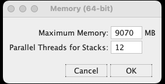
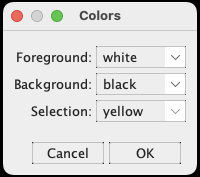
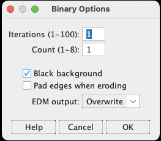

# Setting the scene
We will be using Fiji, which uses ImageJ for image processing. It uses graphical user interface (GUI) but has inbuilt macro processing for advance processing and analysis.
For the GUI it is important to setup the software which is convenient for you and your machine. People can have different preferences but I generally follow following steps to setup the software after I install/update it.

## 1. Memory setting
Do not set maximum memory over 75% of your computer's RAM
In most cases default setting is fine.
You can change the setting in the menubar as below:

`Edit` -> `Options` -> `Memory & Threads...`

## 2. Colors setting
Setup the foreground color as "White', background as "Black", and selection as "Yellow".

`Edit` -> `Options` -> `Colors...`

## 3. Binary options
Set parameters as in the image below and make sure the "Black background" is checked.

`Process` -> `Binary` -> `Options...`

