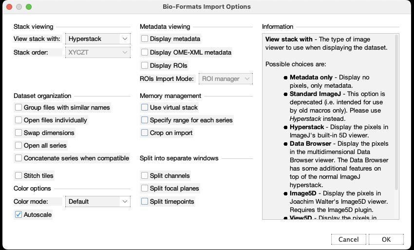

# Lets start with some basic functions.

## To open images:

With the ImageJ built-in functions:
`File` -> `Open`
or
`File` -> `Import`
Or you can simply drag and drop the image file in the FIJI window.

The ImageJ built-in plugin can open most types of scientific image format. In case it doesn't you can use Bio-Formats plugins

`Plugins` -> `Bio-Formats` -> `Bio-Formats Importer`

A window popsup when you open an image file. Most of the time, use `Hyperstack` as the open method. 
You can also also check Autoscale box on the left bottom if not sometimes images might not be visible before you adjust the brightness and contrast.

## To save images:

`File` -> `Save` or `Save As`
          
Save sequence images
          
`File` -> `Save As` -> `Image Sequence...`

## Brightness Contrast

`Image` -> `Adjust` -> `Brightness/Contrast...`

## Convert file type

`Image` -> `Type`

## Merge and split color channels

`Image` -> `Color` -> `Split Channels`

`Image` -> `Color` -> `Merge Channels...`

## Change LUT (Lookup Table)
`Image` -> `Lookup Tables`

## Scale down image size
`Image` -> `Scale`

Tasks:

1. Open `SwimmingAlgae movie.avi` save as a single Tiff stack image.

    

           
Click me

          
           Drag the file into ImageJ menu window, click `OK` at `AVI Reader`
          
          `File` -> `Save As` -> `Tiff...`
          
    

2. Open `Zeiss LSM.lsm`, split channels and merge channels into RGB file, save the merged image as Tiff format.

    

           
Click me

          
           Drag the file into ImageJ menu window
          
          `Image` -> `Color` -> `Split channels`
          
          `Image` -> Color` -> `Merge Channels...` assign according color channel, then click `OK`.
          
          `File` -> `Save As` -> `Tiff...`
          
    

3. Open `Olympus.oib`, choose series 1, separate them into different channels stacks. Do the same thing on `Nikon OptiGrid.nd2` and `Experiment.lif`.

     

           
Click me

          
          Drag file into Image menu window, choose `Hyperstack` at `Bio-Formats Import Options` window option `View stack with`, then click `OK`
          Choose `Series 1`, click `OK`
          
          `Image` -> `Color` -> `Split channels`
          
    

4. Open `A5X.zvi` (a Carl Zeiss image format), adjust brightness and contrast, change image to "8-bit', then save as `Tiff` format.

     

           
Click me

          
          Drag file into Image menu window, choose `Hyperstack` at LOCI window, click `OK`
          
          `Image` ->`Adjust`-> `Brightness/Contrast...` click `auto`
          
          `Image` -> `Type` -> `8 bit`
          
          `File` -> `Save As` -> `Tiff...`
          
    

5. Open `Cell-0001.dm3` (an EM image), convert image to “8 bit” and scale the size down to 1/16 of its original size. Save it as `Jpeg` format.

     

           
Click me

          
          Drag file into Image menu window
          
          `Image` -> `Type` -> `8 bit`
          
          `Image` -> `Scale...` input 0.25 as X Scale and Y Scale
          
          Check `Average when downsizing` and `Create new window` boxes
          
          `File` -> `Save As` -> Jpeg...`
          
     

6. Open `medical_image.DCM` (DICOM format for medical imaging community) and `astronomic.fits` (FITS format for astronomical community.

