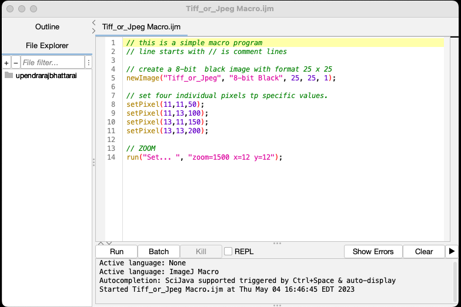

# Image format Tiff vs Jpeg
Run the `Tiff_or_Jpeg Macro.ijm` file in FIJI 
(Drag and drop and hit Run).

Save the result image as Tiff, Jpeg and find three differences.
Hint:
upload both, the tiff and the jpeg images in ImageJ, zoom in and scroll over the four dots at the center, you can see the x, and y coordinates where your pointer is in the image and also the intensity value in ImageJ window. The intensity values in tiff and jpeg are different.

Save the image as `Text image`, see the intensity distributions.

# Saving the image in Jpeg format will distort the original intensity distribution. So its always best to save the images in Tiff format.

# Measurement and ROI (Region of Interest).

`Analyze` -> `Measure` -> `Set measurements...`

ROI manager

`Analyze` -> `Tools` -> `ROI Manager...`
