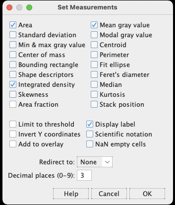
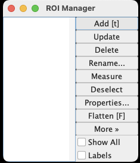

# Image format Tiff vs Jpeg
Run the `Tiff_or_Jpeg Macro.ijm` file in FIJI 
(Drag and drop and hit Run).

Save the result image as Tiff, Jpeg and find three differences.

           
Hints

          
           upload both, the tiff and the jpeg images in ImageJ, zoom in and scroll over the four dots at the center, you can see the x, and y coordinates where your pointer is in the image and also the intensity value in ImageJ window. The intensity values in tiff and jpeg are different.
           Save the image as `Text image`, see the intensity distributions.
          
          

# Saving the image in Jpeg format will distort the original intensity distribution. So its always best to save the images in Tiff format.

# Measurement and ROI (Region of Interest).

You need to setup what measurements you want to get from an image from `set measurements...` option:

`Analyze` -> `Set measurements...`

Then you can obtain the measurements of the selected image with `Measure`

`Analyze` -> `Measure`

Region of Interest (ROI) manager

`Analyze` -> `Tools` -> `ROI Manager...`

This is one of the most useful tool in ImageJ and we will be using it a lot in later sections.

# Let's do some measurements.

Open `cell.tif` from the `Files` folder

1. Manually draw the outline of five cells. Add each ROI into ROI Manager, save the ROI file.

2. Measure the folloing values of each outlined cell.

    size | mean intensity | total intensity | center of mass
    
3. Save the result table as excel .xls file.

---

     
Solution ROI_selection, click me

          
     To draw the outline of cells or for marking the ROI there are several tools available in the FIJI, numbers 1-5 in the image below. 
     If you hover your mouse over them, You can see what those tools can do. To mark irregular shapes like our cells, I prefer the polygon selection (Number 3).
  

  
   
   

     
click me

  
     Open the ROI manager before marking the cells.
     After marking each cells you have to add that selection in the ROI manager, otherwise you will loose the selection. 
     To do that you can click Add in the ROI manager window or simply press `t` , 
     After selecting five cells if you check the `Show All` option in the ROI manager you should see something like below.
 
  

  
   

     
click me

     Once this is done, save the ROI selection from the ROI manager window.
     `More >>` -> `Save...` , make sure the file extension is `.zip`.        
          

     
Measurements, click me

  
      To set up the measurements, go to: `Analyze` -> `Set Measurements...` 
      check `Area`, `Mean gray value`, `Integrated density`, `Center of mass` and click `Ok`
  
 

  
   
   
 

     
click me
 
     In the ROI Manager window, click `Measure`
     you should see a result window as below:
            

   

     
Saving the measurements, click me

        
     In the `Results` window, `File` -> `Save As...` save file as .xls file.
  

