# Let's do some measurements.

Open `cell.tif` from the `Files` folder

1. Manually draw the outline of five cells. Add each ROI into ROI Manager, save the ROI file.

2. Measure the folloing values of each outlined cell.

    size | mean intensity | total intensity | center of mass
    
3. Save the result table as excel .xls file.


---
<details>
     <summary>Solution ROI_selection, click me</summary>
          
     To draw the outline of cells or for marking the ROI there are several tools available in the FIJI, numbers 1-5 in the image below. 
     If you hover your mouse over them, You can see what those tools can do. To mark irregular shapes like our cells, I prefer the polygon selection (Number 3).
  
</details>
  
   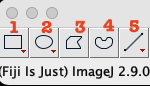
   
<details>
     <summary>click me</summary>
  
     Open the ROI manager before marking the cells.
     After marking each cells you have to add that selection in the ROI manager, otherwise you will loose the selection. 
     To do that you can click Add in the ROI manager window or simply press `t` , 
     After selecting five cells if you check the `Show All` option in the ROI manager you should see something like below.
 
  </details>
  
   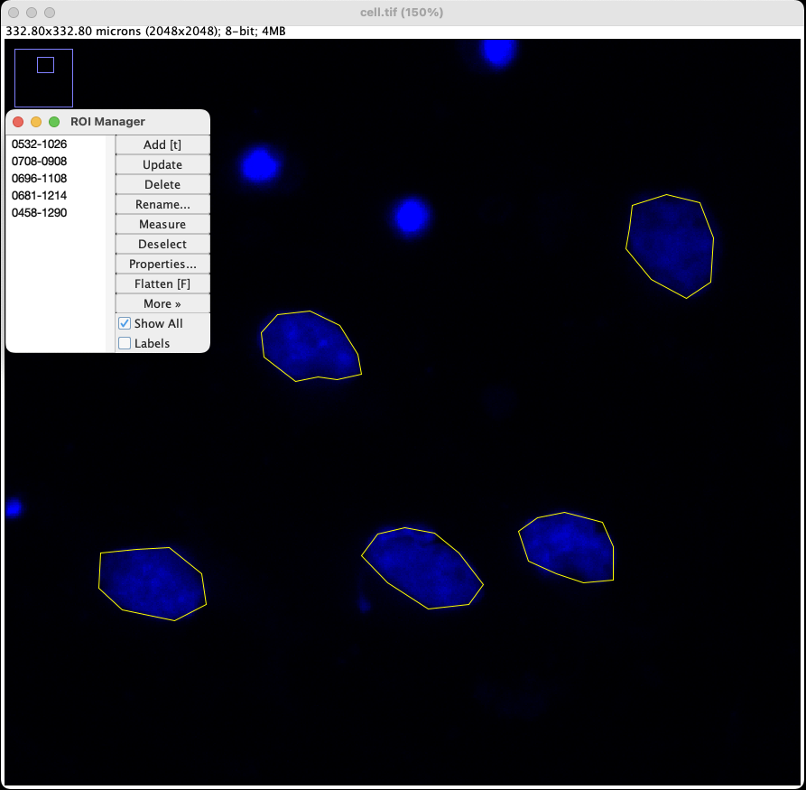

<details>
     <summary>click me</summary>
     Once this is done, save the ROI selection from the ROI manager window.
     `More >>` -> `Save...` , make sure the file extension is `.zip`.        
          
</details>


<details>
     <summary>Measurements, click me</summary>
  
      To set up the measurements, go to: `Analyze` -> `Set Measurements...` 
      check `Area`, `Mean gray value`, `Integrated density`, `Center of mass` and click `Ok`
  
 </details>
  
   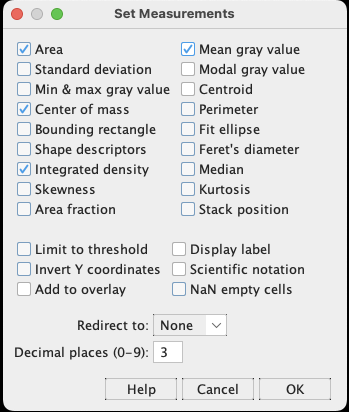
   
 <details>
     <summary>click me</summary> 
     In the ROI Manager window, click `Measure`
     you should see a result window as below:
            
</details>

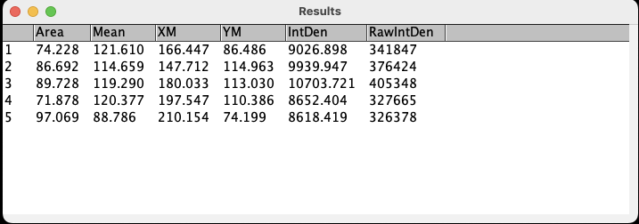


<details>
     <summary>Saving the measurements, click me</summary>
        
     In the `Results` window, `File` -> `Save As...` save file as .xls file.
  
</details>


## Making sense of the measurements and the scale bar

We can check the image pixel scale information at

`Image` -> `Show Info...`
and 
`Image` -> `Properties...`

You can set up the scale bar through

`Analyze` -> `Tools` -> `Scale Bar...`

ImageJ usually does a good job reading scale info through metadata. 
Always make sure the scale info is right (check with Image Acquisition software), or you can use a micrometer slide to calibrate.

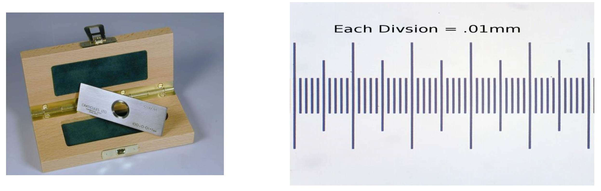

Lets measure the size of the leaf in mm^2 unit.
Open `leaf.tif` image from Files folder.


The smallest division on the ruler in 1mm.
What is the pixel scale 1 pixel = ? mm
We have to correct the pixel scal properties first.

If you check the image properties you see the pixel is not calibrated to the actual mm scale.
First you need to calibrate the actual scale to pixel using the ruler in the image. to do that
Draw a straight line using the straight line tool (No. 5 below).


Its usually preferred to take longer scales as available so draw a straight line from 5 to 13 in the image.
click `Analyze` -> `Measure`. You will get the measurement of the line you drew. The length, which should be ~474 is the lenght in the pixel which corresponds to 80mm unit (13-5 =8cm). so 1 pixel = 0.17 mm.
Now go to:
`Image` -> `Properties` and make the scale changes

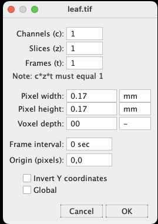

You can measure the straight line again to see if it shows 80mm length.

Now go ahead and draw the leaf outline. Press `t` to record it in ROI Manager, save the ROI (click `More >>` -> `Save As...` in ROI Manager window).

In the ROI Manager window, click `Measure`, the size of leaf should be ~2349 mm^2.

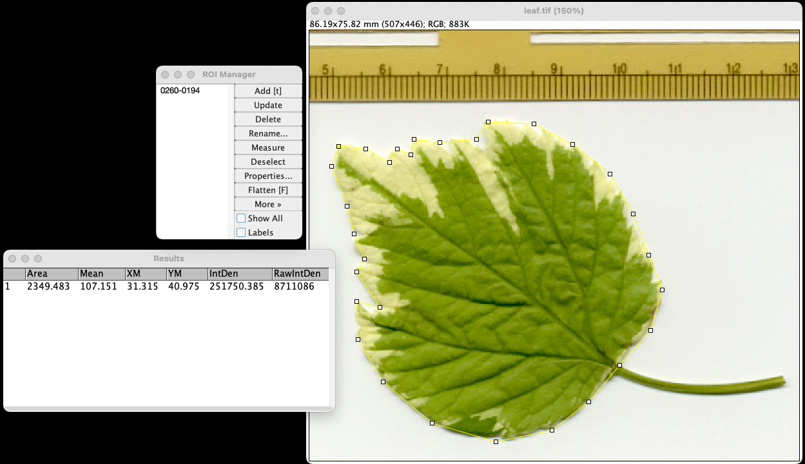


# Thresholding (Segmentation)
Drawing the shapes manually is a lot of work, especially when you have a lots of samples/ROIs. It is more error prone and doesn't make sense when you have big datasets to go through. Thresholding is the simplest method of image segmentation. We can use Thresholding (Segmentation) to create binary images from grayscale images. 
It involves marking individual pixels in an image as an `object` pixels. If their value is greater than the threshold value (assuming an `object` is brighter than the `background`) and as `background` pixels otherwise.

Thresholding is an important part of digital image analysis. You can find it in: `Image` -> `Adjust` -> `Threshold...`

There are different algorithms available in imageJ for thresholding an image.
Forexample, open `mri-stack-1.tif` and try different threshold methods and compare the masked images.
You can find different algorithms to try inside the Threshold window:

`Image` -> `Adjust` -> `Threshold...`

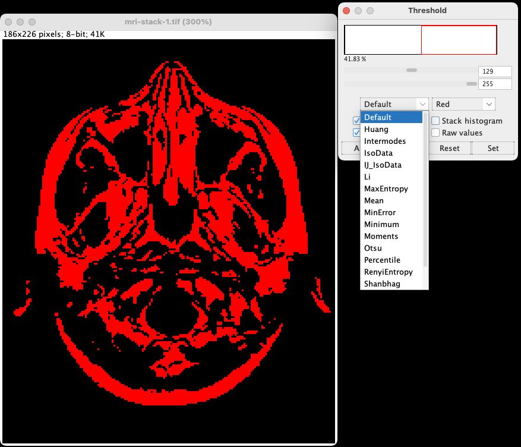

Different algorithms apply thresholds differently:

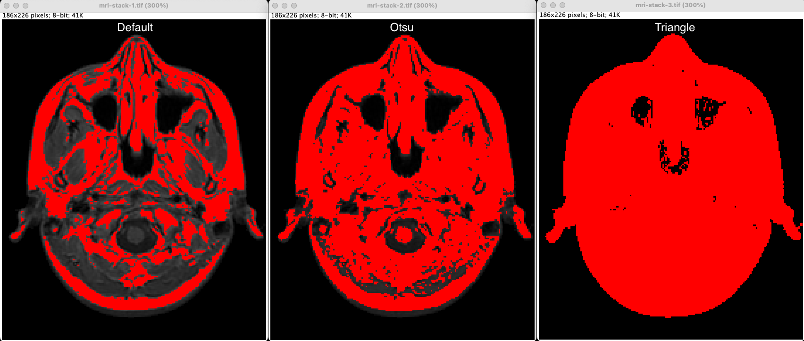

You just have to choose that fits your need. Otsu, triangle, default are the ones I usually try first and fine tune with the threshold value.

Once you set up the appropritate threshold that masks your background from the object. you can convert your image to binary simply from : `Process` -> `Binary` -> `Make Binary`

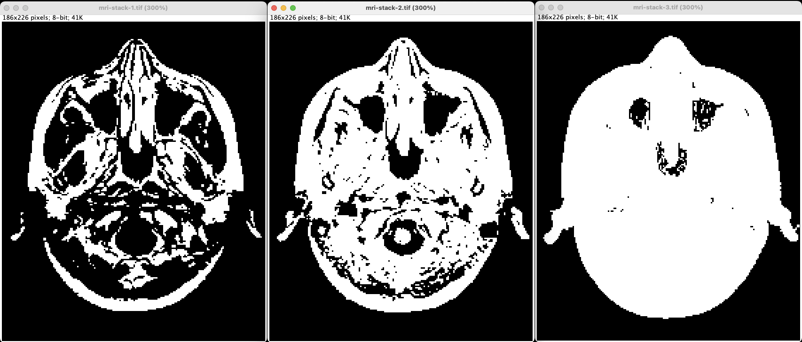

You have to be very careful how your object/s and background are defined. To make it easy, I always have my object in white and background in black. If it is in inverse order in original file, I invert the image to make it my way. If yo need to invert your image, you can do it from `Edit` -> `Invert`

Lets try an example to automatically create a ROI list from an image.
Open `Cells.tif` Zoom in the image for your convenience. 
`Image` -> `Adjust` -> `Threshold`

You can change the thresholding algorithms by clicking the dropdown menu in threshold window (No. 1 below) and/or manually set threshold adjusting the top slider window (No. 2 below).

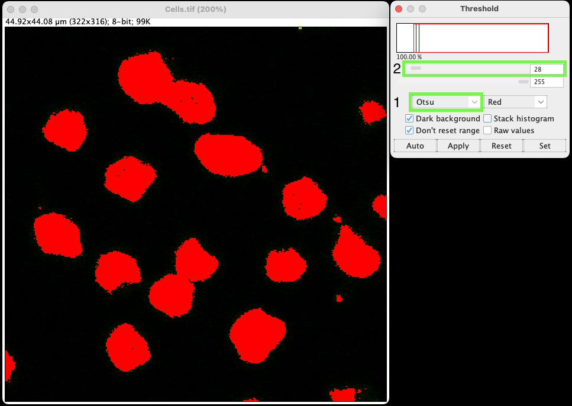

After setting the threshold to pick all the ROIs in our image go to:
`Analyze` -> `Analyze Particles...`

In the Analyze Particles window make sure to Tick `Add to Manager` option.
There are other options in this window for example you can tick the `Exclude on edges` option to exclude partial cells on the edge of the image. If you click `OK`. You will see the cells selected as the Region of Interest and all the ROIs are recorded in ROI Manager.

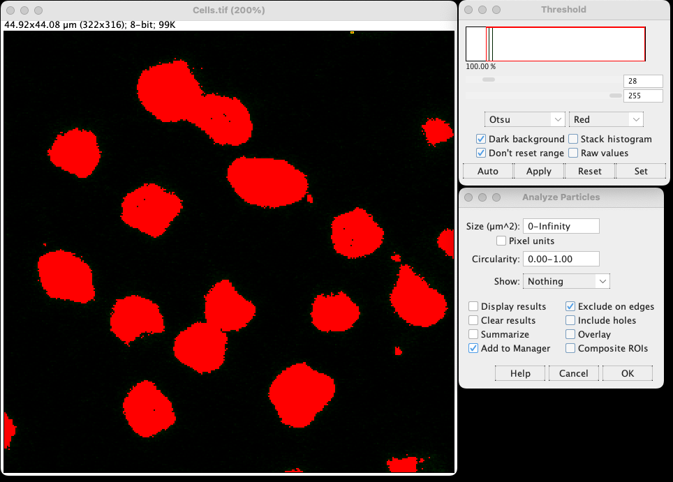

As before if you click `Measure` in ROI Manager It will give you measurements for all the ROIs those were pickedup in the image.

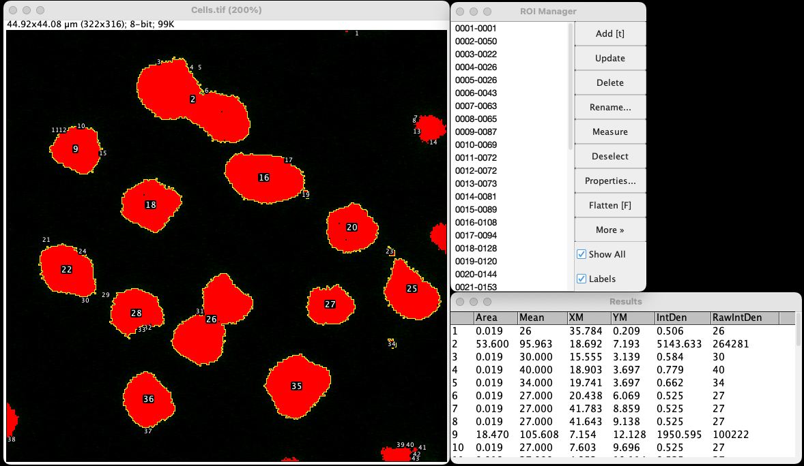

However, the Thresholding/Segmentation doesn't look refined in this case. We will work on this later.

Exercise:
1. Open `dapi.tif` and try different auto-thresholding algorithms to get best object outlines. See which one works best.
2. Do the same with `Dot_Blot.tif` and `embryos.tif` 

# How to acieve better threshold
- We can use different inbuilt filtering options in ImageJ to obtain get better threshold.
    Typical choices are `Gussian Blur`, `Median`, `Mean`.
    We can use filtering options to smooth noisy images.
This option can be found in: `Process` -> `Filters`

Open `cell.tif` try `Otsu` threshold with and without Mean filter. You can apply different radius while filtering the image below is with Radius 1.

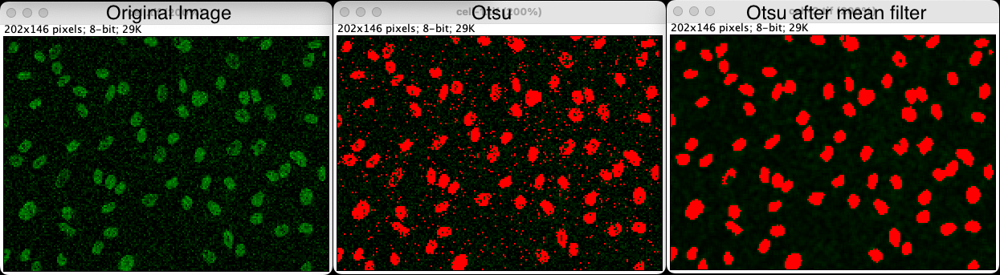

Open `chessboard.tif` 
Lets see how the pixel intensity is distributed across the black and white squares.
Draw a straight line with `Straight line` tool through the first row of the squares.
`Analyze` -> `Plot Profile`
It will generate a plot with Gray Value on the y and distance in pixels in the X.

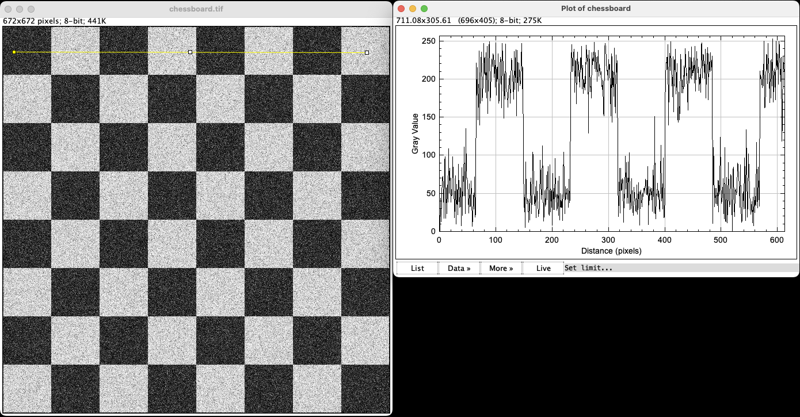

Try Mean and Median filter on the `chessboard.tif` with Radius 20.
and plot the profile with straight line. You will get following results.

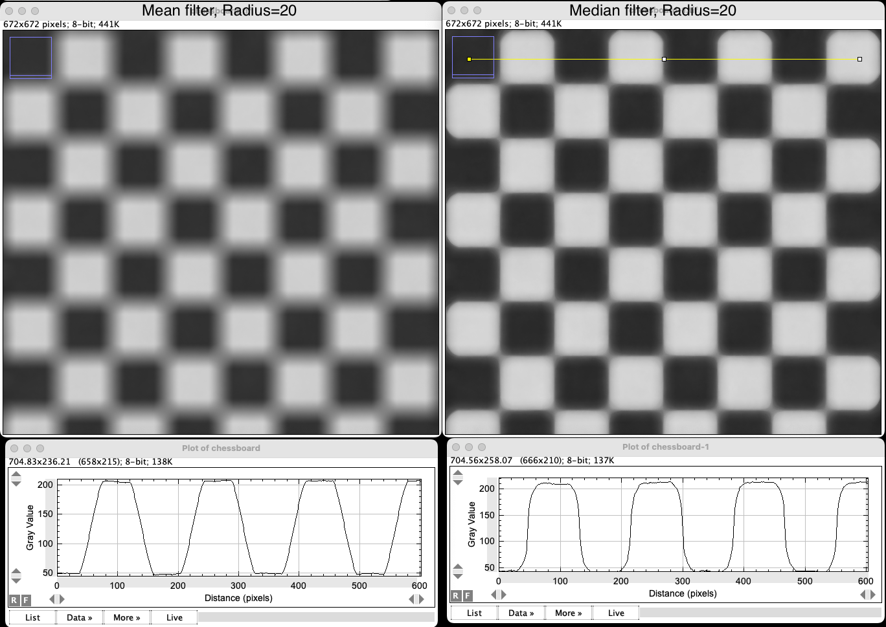

It shows Median filter researves edges better than Mean filtering.

- We can also remove background to get better threshold.
You can find option background substraction in:
`Process` -> `Substract Background...`

Rolling ball method calculates the local background, check: [Rollingball](Reading/RollingBall.pdf) for more info.
```
As a rule of thumb, the "radius" should be at least as large as the radius of the largest object in the image that is not part of the background.
```
open `background.tif` to increase the image contrast you can:
`Image` -> `Lookup Tables` -> `Fire`

As we can see the background brightness is in an increasing gradient from left to right. In such cases we can Rolling ball method of background substraction can be effective to establish better threshold.

Always make sure, you are treating background and foreground as you should be (as you have setup in the Fiji software)
While substracting background you have to unselect the Light background option, as we are treating background as black.
To make sure the background and object color is set correctly go to:
`Edit` -> `Options` -> `Colors...`


- There are several options inside Binary which can be helpful to get better ROIs after thresholding step.


For the `background.tif` 

Go to:
1. `Substract background`(Rolling ball Radius 50)
2. `Median Filtering` (Radius 1)
3. `Threshold` (Otsu default)
4. 


